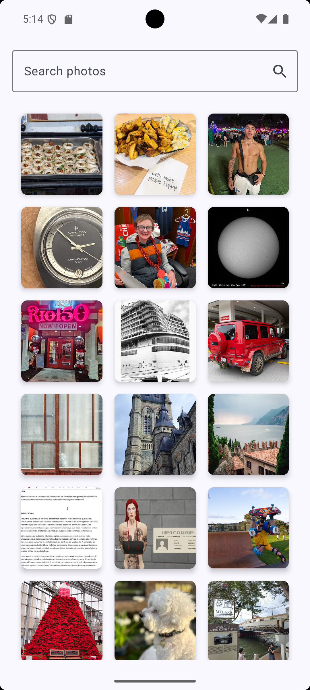
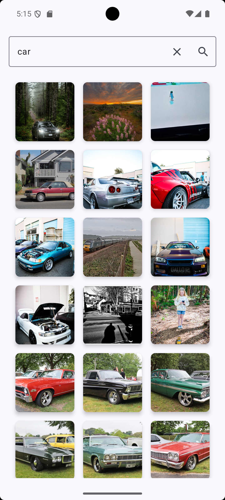
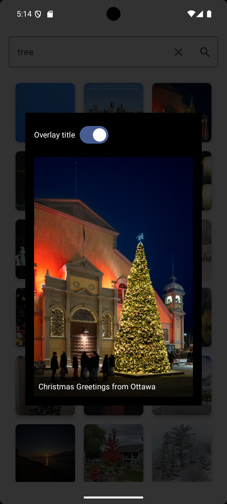
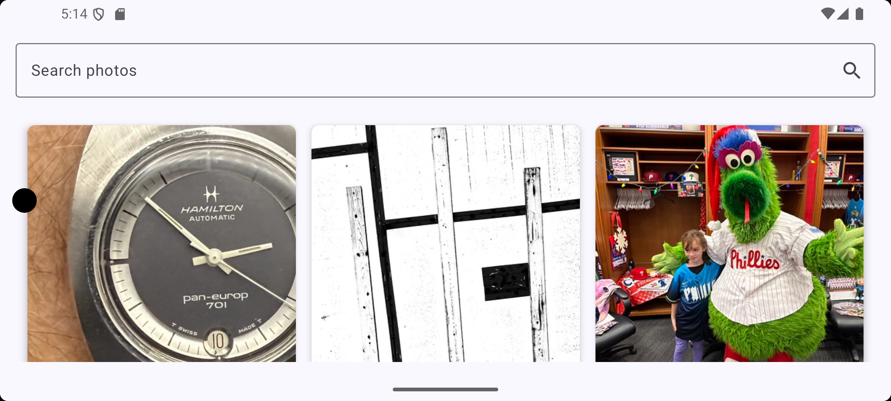

# Omada Take Home Test - Android
## Features
- Fetch recent photos from Flickr
- Search photos by text query
- Manual Pagination
- Loading and error state handling
- Enlarged photo view maintaining correct aspect ratio (Bonus)
- Optional overlay for photo titles (Extra)
- Orientation (Landscape mode) persistance
- Unit tests for ViewModel, Repository (Bonus)

## Architecture & Technologies
- Kotlin + Jetpack Compose
- ViewModel + StateFlow for UI state
- Retrofit for networking
- Dagger for DI
- Coil (AsyncImage) for image loading
- JUnit + Mockito for unit testing

## Screenshots + Recording

| Recent Images | Search - Car |
|---------------|---------------|
|  |  |

| Enlarged Image | Landscape Mode |
|---------------|---------------|
|  |  |

## Demo Video

| Demo |
|------|
| <video src="Docs/Videos/final_rec_mob.mp4" width="300" controls></video> |

## Future Scope
- Implement more test coverage, Integration tests and also snapshot tests
- Add localized caching
- Add support for Theming (Light / Dark mode)
- Add navigation logic - if we need to go to multipe different screens.
